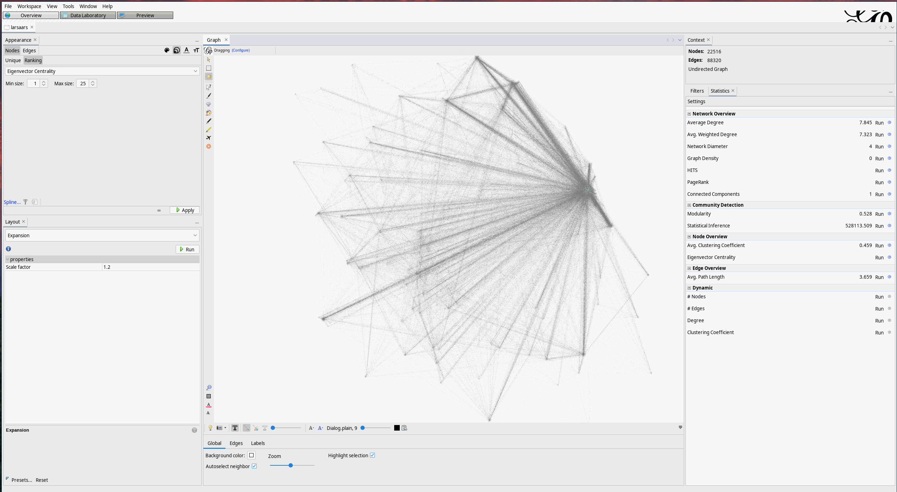

# Instagram Analyzer
Analyze instagram social networks with visualizations.

## How does it work?

- The program first scrapes using your personal Instagram account using [selenium](https://www.selenium.dev/) your instagram followers and the people they follow (depth 1 and 2).
- Afterwards it uses an [unofficial Instagram API](https://adw0rd.github.io/instagrapi/) to scrape the followers of the followers of you etc. (depth 3+, the API is way faster than the selenium scraping, but you probably don't want to get your main account banned, so using Selenium instead).
- In the third step it creates nodes and edges for a graph to visualize your social network. This can be done using [Gephi](https://gephi.org/) for example.


## How to use

- Install packages: `pip install -r requirements.txt`
- It is advised to use another (unimportant) account than the selenium crawler account when scraping with the API, since the chances of getting banned there are quite high; using selenium rather low
- In your `.env` file put:
```
IG_SELENIUM_USERNAME=
IG_SELENIUM_PASSWORD=

IG_API_USERNAME=
IG_API_PASSWORD=

MAX_FOLLOWERS_API=1000
MAX_SCROLLING_SELENIUM=200

ANALYZE_DEPTH=3
MIN_NUM_OF_RELATIONS=3

PATH_TO_NODES_FILE=./results/nodes.csv
PATH_TO_EDGES_FILE=./results/edges.csv
```

- `edges.csv` and `nodes.csv` can be imported in a software like [Gephi](https://gephi.org)
- [Gephi tutorial](https://www.youtube.com/watch?v=HJ4Hcq3YX4k)
- for labels copy in node table the id values to Label values
- let OpenOrd run as algorithm and then Expand mutliple times
- change text and node size at will etc for better understanding of the network


